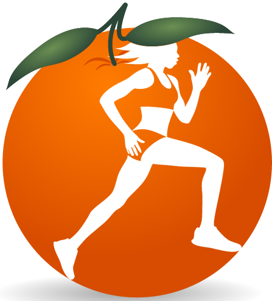

# ORunge-Tracker
 The app counts the kilometers traveled and graphically draws the route on the Google Map (Google Map Api). 
Use of databases (pure sql) and statistics for each profile.

## Application
First, if not present, the creation of a new athlete profile will be requested.
The list of profiles can be easily consulted with the appropriate navigation menu.
Each profile has its own statistics, calculation of average speeds, distances traveled. The athlete has at the disposal of the graphs to consult these parameters.
The Settings voice are very rich and it is possible to calibrate the app to optimize the impact on the battery. 
While starting a sports session, a convenient menu in the notification bar reports parameters such as distance traveled, calories etc ...

## Screenshot app
       

I was particularly satisfied with the aesthetic result despite not being a graphic designer, I also think it is quite intuitive.
One of the few projects in which I have particularly cared for the graphic side. The app has been tested up to Android Oreo. 
Please note that this is an app written years ago for "Mobile Systems" course. Android studio updates continuously, there may be incompatibility issues for recent versions of java.
